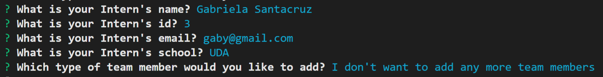

# Template_Engine-Employee_Summary


Links : [Project](https://cesaraugustomartinez.github.io/Template_Engine-Employee_Summary/), [Video](https://cesaraugustomartinez.github.io/README_Generator/video.html), [Repository](https://github.com/CesarAugustoMartinez/Template_Engine-Employee_Summary)

---

### Table of Contents

- [Description](#description)
- [How to Use](#how-to-use)
- [Screenshots](#screenshots)
- [References](#references)
- [License](#license)
- [Author Info](#author-info)

---

## Description

The goal of this project is cerate a command-lin application that takes information about employees and dynamically generates an HTML webpage that displays summaries for each person. The user will enter data using inquirer.prompts [Inquire package](https://www.npmjs.com/package/inquirer). This app was builded using NODE.js code to generate a dynamically command-line app. 

##### Technologies

- JavaScript
- RegExr
- Visual Studio Code
- Node.js
- Package.json
- Html

##### Code sample - JavaScript - RegExr
#

```js
const Manager = require("./lib/Manager");
const Engineer = require("./lib/Engineer");
const Intern = require("./lib/Intern");
const inquirer = require("inquirer");
const path = require("path");
const fs = require("fs");
const logo = require('asciiart-logo');

fs.rmdirSync("output", { // Deleting if the folder already exist
    recursive: true, 
  }); 
fs.mkdirSync(path.join(__dirname, "output")); // Creating the folder for html file
const OUTPUT_DIR = path.resolve(__dirname, "output");
const outputPath = path.join(OUTPUT_DIR, "team.html");

const render = require("./lib/htmlRenderer");

const employeesArray = []; // Declaring an array of objects

const valName = async (input) => { // To validate name
    if (input === '' || /^\s+$/.test(input)) {
       return 'Incorrect asnwer. It must contain at least a character';
    }
    return true;
 };

```
##### Code sample - package.json
#
```json
 {
  "name": "unit10hw",
  "version": "1.0.0",
  "description": "OOP and testing for week 10 homework",
  "main": "app.js",
  "directories": {
    "lib": "lib",
    "test": "test"
  },
  "scripts": {
    "test": "jest --verbose test/*"
  },
  "repository": {
    "type": "git",
    "url": "git+https://github.com/stevetrilogy/unit10hw.git"
  },
  "author": "",
  "license": "ISC",
  "bugs": {
    "url": "https://github.com/stevetrilogy/unit10hw/issues"
  },
  "homepage": "https://github.com/stevetrilogy/unit10hw#readme",
  "dependencies": {
    "asciiart-logo": "^0.2.6",
    "inquirer": "^6.3.1"
  },
  "devDependencies": {
    "jest": "^24.8.0"
  }
}

```

##### Code sample - How to create a class
#
```js
// TODO: Write code to define and export the Engineer class.  HINT: This class should inherit from Employee.
const Employee = require("./Employee");

class Engineer extends Employee{
    constructor(name,id,email,github){
        super(name,id,email);
        this.github = github;        
    }
    getGithub(){
        return this.github;
    }
    getRole(){
        return 'Engineer';
    }
} 

module.exports = Engineer;

```
---

## How To Use

This web application has a principal app.js file where the user will invoke it by using the commmand node app.js into the terminal. Once It has been invoked the app will prompt the user for information about the team manager and then information about the team members. The user can input any number of team members, and they may be a mix of engineers and interns.
 
## Screenshots

- Command to run the app and principal screen


- Manager's Inputs 


- Engineer's Inputs and validation


- Intern's Inputs



- Data - Array


[Back To The Top](#Template_Engine-Employee_Summary)

---

## References

- w3school -- [Node.js NPM](https://www.w3schools.com/nodejs/nodejs_npm.asp)
- NPM -- [Node Package Managment](https://www.npmjs.com/)
- Inquirer -- [Inquirer.js](https://www.npmjs.com/package/inquirer)
- Node.js -- [About Node.js](https://nodejs.org/en/)
- Node.js -- [The package.json guide](https://nodejs.dev/learn/the-package-json-guide)
- RegExr -- [Regular Expressions](https://regexr.com/)


[Back To The Top](#Template_Engine-Employee_Summary)

---

## License

Copyright (c) [2020] [Cesar A Martinez]

[Back To The Top](#Template_Engine-Employee_Summary)

---

## Author Info

- Twitter -- [@cesaguma](https://twitter.com/cesaguma)
- Linkedin -- [Cesar A Martinez](https://www.linkedin.com/in/cesar-augusto-martinez-auquilla-03934a16b/)
- GitHub -- [CesarAugustoMartinez](https://github.com/CesarAugustoMartinez)

[Back To The Top](#Template_Engine-Employee_Summary)
